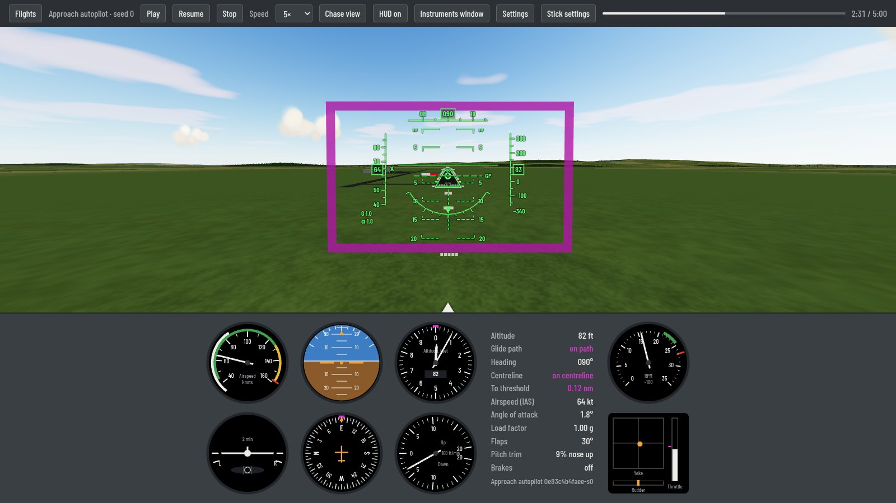
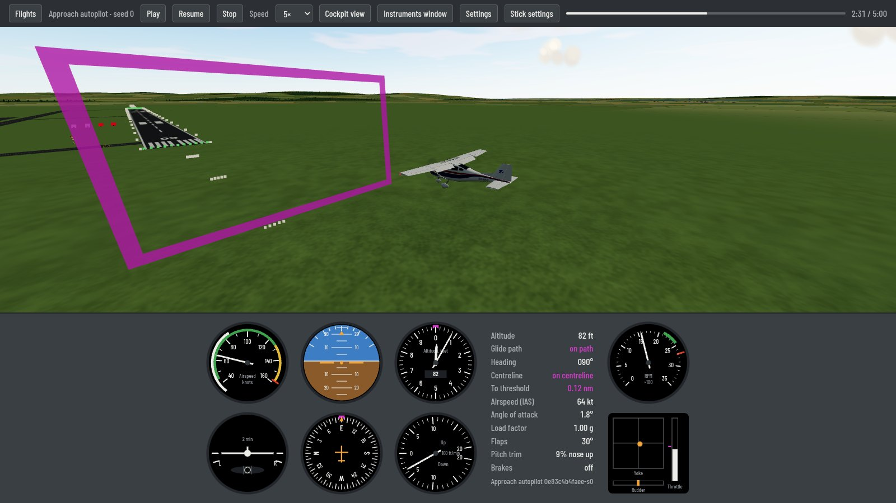

# nano-fs

[](LICENSE)


A small, physically accurate Cessna 172 flight simulator for training and research.
One physics core (JSBSim) serves three uses: fast headless simulation for batch
experiments and machine learning, reproducible flight logs, and a real-time 3D viewer
you can fly with a keyboard, gamepad or joystick.





## What it does

- **Flight model:** JSBSim's Cessna 172P with full 6-DOF dynamics, aerodynamic
  coefficient tables, piston engine and fixed-pitch propeller, ground contact with
  brakes and nosewheel steering. A tuned copy (`c172p_tuned`) matches the POH climb,
  takeoff and landing figures more closely.
- **Weather:** steady wind, Dryden turbulence (MIL-F-8785C) and low-altitude crosswinds
  with wind shear and gusts, all seeded and reproducible.
- **Tasks** (Gymnasium environments): hold altitude and heading; approach and landing on
  runway 09 with a full-stop rollout; takeoff and climb-out; a complete left-hand
  circuit; GPS navigation along a route of waypoints (random per seed or named, in
  latitude/longitude). Each in calm air or with wind, gusts and turbulence.
- **Autopilots:** PID and gain-scheduled LQR for altitude and heading, plus approach,
  takeoff, circuit and route autopilots that fly the tasks end to end. Reinforcement
  learning with PPO (Stable-Baselines3) on the same interface.
- **Earth model:** JSBSim flies on the WGS84 ellipsoid; the world map is a transverse
  Mercator projection around a configurable origin, with true and map north kept apart,
  so positions, distances and bearings are accurate to about a millimetre across the
  simulated world.
- **Real-world scenery:** Abu Dhabi around Al Bateen Executive Airport (OMAD), 104 km
  square, built offline from open data: bare-earth elevation (FABDEM) under the wheels
  and in the view, Sentinel-2 satellite imagery and ESA WorldCover land cover, a sea
  with waves, reflections and turquoise shallows, a 42 °C summer day with the
  prevailing north-westerly wind, and OpenStreetMap runways, roads,
  taxiways, aprons and 110,000 buildings, with date palms and mangroves. The physics
  flies on the same ground the viewer draws, touching the sea ends the flight, and every
  log records the scenery it flew over. The same scenarios as the procedural world fly
  there on runway 31 (fly them or watch the autopilots).
- **Logs:** one Parquet row per simulation step with a fixed, versioned schema in SI
  units; the same seed and config give byte-identical files.
- **Viewer:** Three.js in the browser, offline. Chase and cockpit views, the six-pack,
  tachometer and control positions, a GPS unit (position, ground speed, track, distance,
  bearing and time to the runway or the next waypoint, desired track and cross-track
  error), an optional head-up display, an instruments window and a moving-map window for
  more monitors (terrain, villages, roads, the route and your track), a corner map, a
  stabilized belly camera you point and zoom (in the view, its own window or beside the
  map; its overlay gives the position of the ground under the crosshair),
  procedural scenery with an airfield, PAPI and windsock, time of day, clouds, the
  aircraft's real shadow and synthesized sound. Replays of any recorded
  flight, and a list of your past flights with their results (landed, nose wheel first,
  climbed out…).

## Accuracy

The model is checked against published data by automated tests, mainly the 1985 Cessna
172P Pilot's Operating Handbook: cruise RPM, power and fuel flow, stall speeds, climb
rate, takeoff and landing distances, and the phugoid against an AAIB flight trial.
The tuned model passes 32 checks with 6 known deviations, among them stall speeds 3-5 kt
fast in three configurations and a phugoid about 20 % short. See
[`docs/VALIDATION_c172p_tuned.md`](docs/VALIDATION_c172p_tuned.md) (and
[`docs/VALIDATION.md`](docs/VALIDATION.md) for the stock model) with sources in
[`docs/REFERENCES.md`](docs/REFERENCES.md).

## Quick start

Requirements: [uv](https://docs.astral.sh/uv/) (it installs Python 3.14) or Docker, and a
recent Firefox or Chromium for the viewer. Developed and tested on Linux (Debian 13).

```sh
git clone https://github.com/SonapSav/nano-fs.git
cd nano-fs
uv sync
uv run python -m flightsim.stream     # then open http://localhost:8686/
```

With Docker:

```sh
uv run python scripts/docker.py up -d --build viewer   # or: docker compose up -d viewer
```

The first start designs the LQR gain schedule (about 15 s) and caches it in `data/`.

The Abu Dhabi scenery is built once from its open data sources (downloads about 1 GB
into `data/scenery/`, then about five minutes):

```sh
uv run --group scenery python scripts/build_scenery.py configs/scenery/abu_dhabi.yaml
```

The Flights drawer then offers the Abu Dhabi scenarios (they need the built scenery).

## Flying

Open **Flights** (or press `L`), pick a scenario (free flight, approach, takeoff,
circuit or a GPS route, calm or windy, with a seed) and press **Fly**. Your flights are saved as
demonstrations in `data/demos/` and listed under **Past flights**.

| Keys | |
|---|---|
| Arrows | pitch and roll (build up while held; Shift for full deflection) |
| `Z` / `X` | rudder and nosewheel |
| `W` / `S` | throttle |
| `F` / `V` | flaps up / down one detent |
| `T` / `G` | pitch trim nose down / up |
| `B` | brakes |
| `C` | cockpit / chase view |
| `H` | head-up display (cockpit view) |
| `R` or double-click | re-centre the view |
| `L` | flights |
| `I` | corner map (wheel to zoom, click for north up / track up) |
| `K` | belly camera in the view (drag to point, wheel to zoom, double-click: straight down) |
| Numpad `4` `6` `8` `2`, `+` `−`, `5`, `0` | point and zoom the camera, straight down, follow a replay's recorded camera |
| `P` | frame rate readout (Settings → Frame limit draws every second or third refresh, for a steadier, cooler picture) |
| `M` | sound on / off |
| Space | pause |

**More monitors:** **Instruments window** opens the panel on its own, **Map window** a
moving map (`+` / `−` zoom, `N` north up / track up, `K` map / map and camera / camera) and
**Camera window** the belly camera; press F11 there for full screen.
Keys typed in either window still fly the aircraft.

**Gamepads and joysticks** (tested with an Xbox pad and a Thrustmaster T.Flight HOTAS X):
open **Stick settings**, map each axis and button with **Detect**, calibrate the
centre, and set sensitivity and expo per device.

## For research

```sh
# 1000 seeded episodes of a task and policy, in parallel, with statistics
uv run python scripts/batch_run.py --env-config configs/envs/approach_landing_crosswind.yaml --policy approach --seeds 0:1000

# The route autopilot on 1000 random GPS routes in wind and turbulence
uv run python scripts/batch_run.py --env-config configs/envs/navigation_wind.yaml --policy route --seeds 0:1000

# Compare the PID and LQR autopilots
uv run python scripts/compare_controllers.py --episodes 100

# Train PPO, then evaluate it like any other policy
uv run python scripts/train_rl.py configs/rl/ppo_comfort.yaml
uv run python scripts/batch_run.py --policy rl --rl-model data/rl/<run_id>/best --seeds 0:1000

# Regenerate the validation report
uv run python scripts/validate.py configs/validation/c172p_tuned.yaml --out docs/VALIDATION_c172p_tuned.md
```

- **Reproducibility:** every run takes a seed and a config file (YAML, with
  `base:` inheritance). Each log records the config and its hash, the seed, the JSBSim
  version, a hash of the aircraft files and the code version.
- **Log format:** `flightsim/datalog/schema.py` (version 2): full state, control
  surface commands and positions, trim condition, float64. Manual flights also record
  when the head-up display was in view, so human demonstrations with and without it
  can be told apart.
- **Fair comparisons:** autopilots, learned policies and human pilots all act through
  the same environment interface at the same decision rate.

## How it fits together

```
              +- headless runner / batches -> Gymnasium envs -> autopilots, RL
Physics core -+- logger (Parquet, fixed schema) -> analysis, training data
(JSBSim)      +- state stream (WebSocket) -> Three.js viewer + instruments
```

The viewer only consumes state. A manual flight's stick, pedals and throttle reach the
physics only as policy actions through the environment, at the fixed decision rate.

| Folder | |
|---|---|
| `flightsim/core/` | JSBSim wrapper; the only place JSBSim is used (SI units outside) |
| `flightsim/aircraft/` | the tuned C172P model (LGPL, see its README) |
| `flightsim/envs/` | tasks: altitude/heading hold, approach, takeoff, circuit, navigation (routes) |
| `flightsim/control/` | PID, LQR, approach, takeoff, circuit and route autopilots; human input |
| `flightsim/world/` | WGS84 geodesy and map projection; the terrain shared with the viewer |
| `flightsim/datalog/` | log schema and Parquet reading and writing |
| `flightsim/stream/` | WebSocket server, live and replay sources, flight results |
| `flightsim/viewer/` | the browser viewer (no build step; three.js and the font vendored) |
| `flightsim/analysis/` | mode identification and validation manoeuvres |
| `configs/` | tasks, autopilots, RL and validation configs |
| `docs/` | references, validation reports |
| `scripts/` | batch runs, controller comparison, RL training, validation, Docker |

## Tests

```sh
uv run pytest
```

About 330 tests: physics validation against the POH with stated tolerances,
reproducibility of logs, the tasks and autopilots, the stream protocol, and the viewer's
JavaScript (run with Node when it is installed).

## Status

Work in progress; [`PROJECT.md`](PROJECT.md) lists what is done and what is pending.

## Licence and credits

MIT, see [`LICENSE`](LICENSE). The tuned aircraft model in `flightsim/aircraft/c172p_tuned/`
is a modified copy of JSBSim's c172p and stays under the LGPL-2.1 or later. Bundled
three.js (MIT) and the Barlow Condensed font (OFL) keep their licences; see
[`THIRD_PARTY.md`](THIRD_PARTY.md).

Built on [JSBSim](https://github.com/JSBSim-Team/jsbsim) and [three.js](https://threejs.org/).

The real-world scenery is not part of the repository: `scripts/build_scenery.py`
downloads and builds it on your machine, for non-commercial use, under these terms
(shown in the viewer while flying there):

- FABDEM V1-2 (Hawker et al. 2022, *A 30m global map of elevation with forests and
  buildings removed*, Environmental Research Letters; University of Bristol), CC BY-NC-SA
  4.0. FABDEM is produced using Copernicus WorldDEM-30 © DLR e.V. 2010-2014 and © Airbus
  Defence and Space GmbH 2014-2018 provided under COPERNICUS by the European Union and
  ESA; all rights reserved. The organizations in charge of the Copernicus program by law
  or by delegation do not incur any liability for any use of the Copernicus WorldDEM-30.
- © ESA WorldCover project 2021 / Contains modified Copernicus Sentinel data (2021)
  processed by ESA WorldCover consortium (CC BY 4.0).
- © OpenStreetMap contributors. The data is available under the Open Database License
  (ODbL); extracts from Geofabrik.
- Contains modified Copernicus Sentinel data 2025 (Sentinel-2 L2A, 24 October 2025, via
  AWS Earth Search).
Reference data from the Cessna 172P Pilot's Operating Handbook, FAA handbooks and
advisory circulars, MIL-F-8785C and the AAIB, cited in `docs/REFERENCES.md`.

**Not for real-world flight training or any certified use.** It is a research and
learning tool; the aircraft model deviates from the real aeroplane in places (see
Accuracy).
